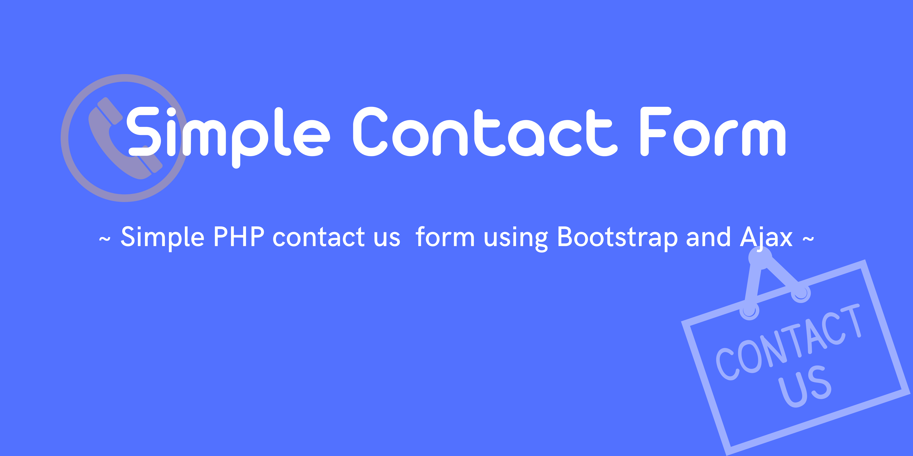

## # Installation

```bash
composer install
```

```bash
composer update
```

```bash
cp .env.example .env
# or you can manual copy paste file .env.example to .env if this command doesn't working.
```

## # Debugging

```bash
php -S localhost:port
```

## # Video Demo

[](https://www.youtube.com/watch?v=oAHHn8zVMLE)


## # Requirements

- [PHP](https://www.php.net/downloads.php)
- [Composer](https://getcomposer.org/download/)
